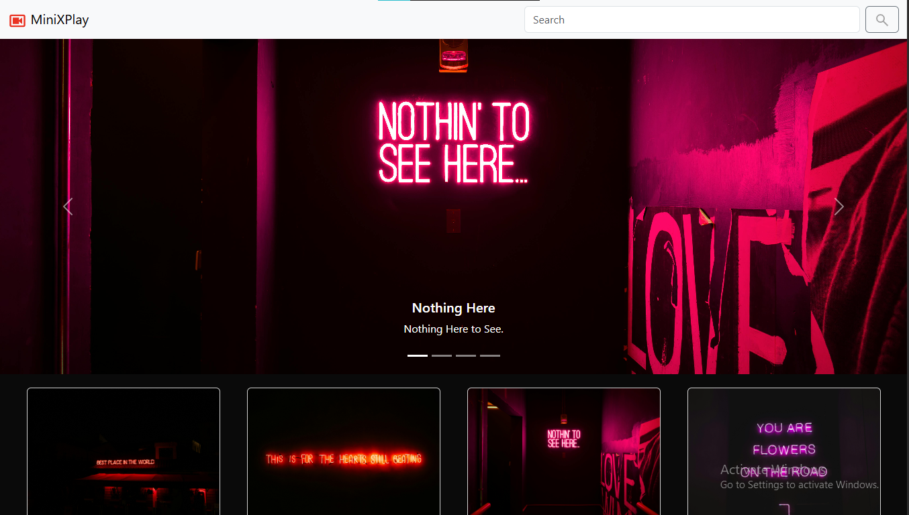

# 🎵 MiniXPlayer

A sleek, fully responsive music player web app built using **HTML**, **CSS (Bootstrap 5)**, and **JavaScript**. This lightweight web music player allows you to play and navigate your favorite songs seamlessly across all devices.

🌐 **Live Demo**: [MiniXPlayer](https://deeps1970.github.io/MiniXPlayer/)

## 🚀 Features

- 🎧 Play/Pause functionality
- ⏭️ Next/Previous track navigation
- 🔁 Loop and 🔀 shuffle features
- 📱 Fully responsive (mobile, tablet, and desktop) using **Bootstrap 5**
- 🎨 Animated UI and hover effects
- 📂 Easily customizable playlist
- 🔊 Volume and playback controls

## 🛠 Tech Stack

- **HTML5**
- **CSS3** (Bootstrap 5 for layout & responsiveness)
- **JavaScript (Vanilla)**

## 📸 Screenshots



## 📦 How to Use

```bash
1. Clone the repository:
git clone https://github.com/deeps1970/MiniXPlayer.git

2. cd MiniXPlayer

3. Open index.html in your browser.
```

## 📱 Responsiveness
MiniXPlayer is fully responsive, adapting to:

- Mobile phones
- Tablets
- Laptops & Desktops

## 📃 License
This project is open-source and free to use under the MIT License.

## 🤝 Contributing
Feel free to fork this project and submit pull requests. Suggestions and issues are welcome!
